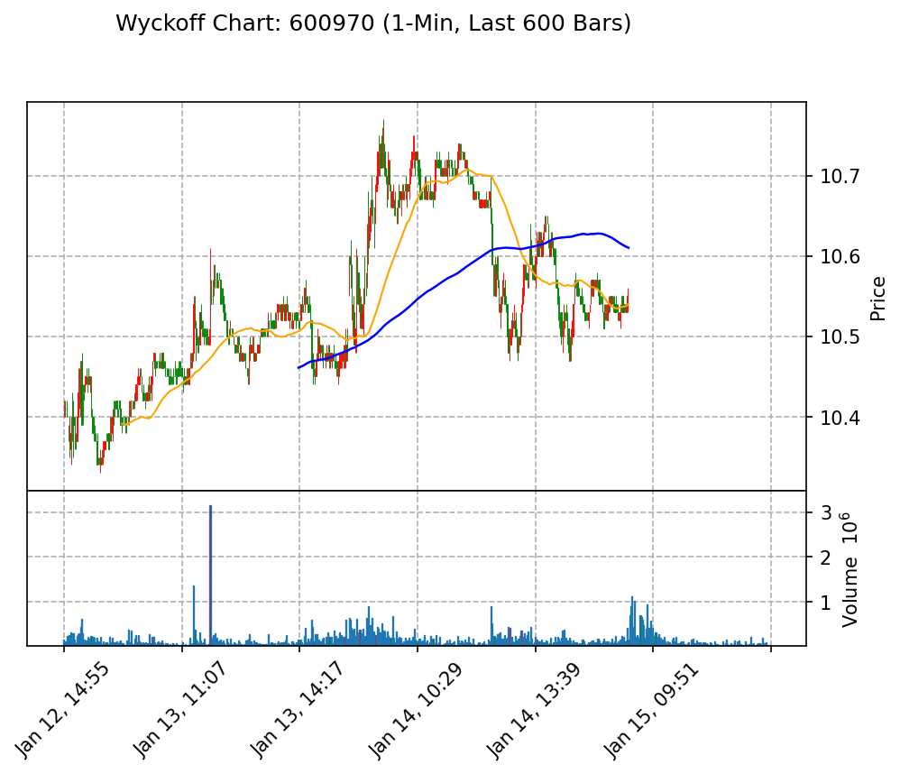

# 威科夫分析报告

## 1. Background (位置与趋势)
当前微观结构显示出明显的**吸筹**特征。成交量在早期阶段（09:31 - 10:00）出现了较高的波动，随后在10:00之后逐渐减弱，表明市场参与者正在进行潜在的吸筹行为。供求关系方面，尽管成交量有所下降，但整体供给并未显著增加，显示出**需求占优**的状态。

## 2. Key Events (关键行为)
在分析过程中，我们可以识别出以下关键行为信号：
- **SC (Selling Climax)**: 在09:46 - 09:50之间，成交量达到947100，随后出现了一定的价格回调，可能暗示市场的卖压减弱。
- **LPS (Last Point of Support)**: 在10:10 - 10:15之间，成交量相对较低（71400 - 119700），但价格未显著下跌，显示出市场的支撑力度。
- **UT (Upthrust)**: 在11:14时，成交量激增至221500，可能暗示短期内的卖压增加。

结合“努力与结果”的分析，尽管在某些时段成交量较高，但价格并未显著下跌，表明市场参与者的买入努力在逐渐增强。

## 3. Trade Plan (交易计划)
- **做多信号**: 如果出现价格突破前高（例如11:14的高点）并伴随成交量增加，考虑做多。
- **做空信号**: 如果价格跌破LPS区域（例如10:10的低点）并伴随成交量增加，考虑做空。
- **止损位**: 对于做多交易，止损位可以设定在LPS下方（例如10:10的低点附近）。对于做空交易，止损位可以设定在最近的高点（例如11:14的高点附近）。

通过以上分析，我们可以在当前市场环境中制定合理的交易策略，以应对未来的市场波动。